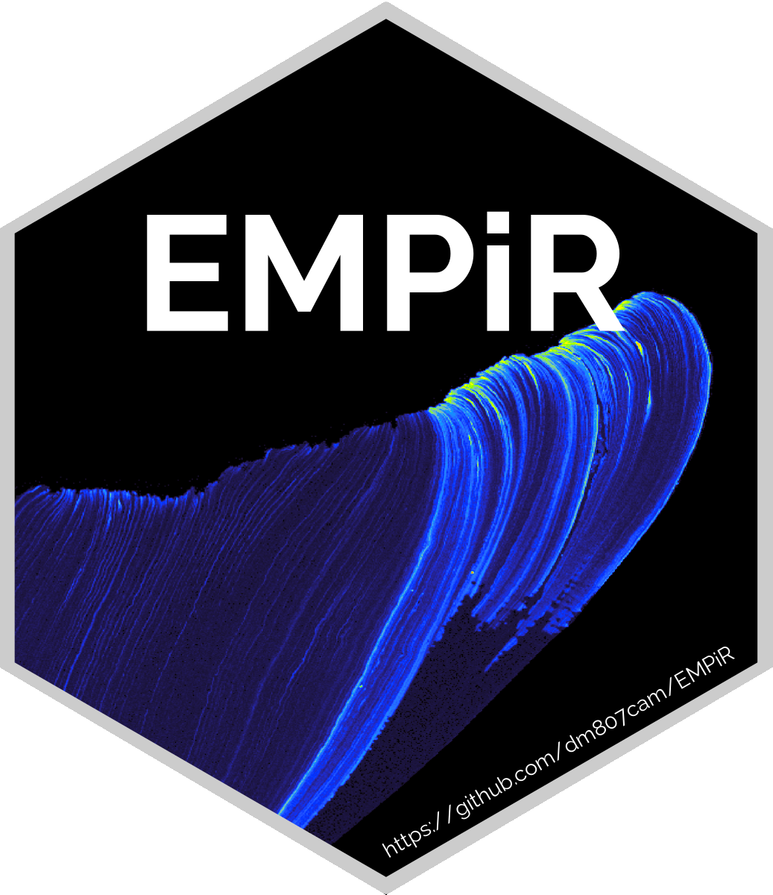

EMPiR
================

### Electron MicroProbe in R

 This
package provides pipe-friendly framework to import, calibrate and
evaluate EMP data in the R language.

## Usage

    get_prob(data_path = "path/to/file",
             data_name = "file.txt") %>%
      image_prob(legend_unit = 'Sample [counts]',
                 scale_location = 'bottom_left',
                 beam_size = 6) 

## Install

As of now, EMPiR is experimental and not available through CRAN.  
In the meanwhile, EMPiR can be installed directly from this Github
repository using ‘devtools’. 
`devtools::install_github('dm807cam/EMPiR')`  Please expect many
substantial changes in the next weeks. The first release of a stable
version is expected for the start of November, 2021.   To report
a bug or submit a feature request please open a ticket or contact me by
mail.
