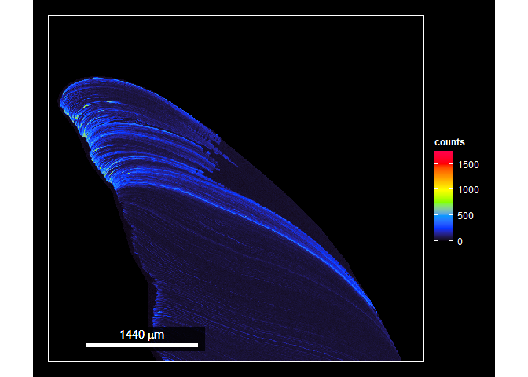
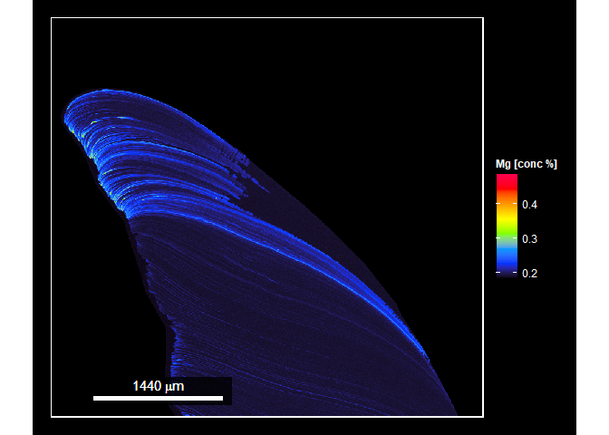

EMPiR
================

### Electron MicroProbe in R


[](https://lifecycle.r-lib.org/articles/stages.html#experimental)
[](https://github.com/dm807cam/EMPiR/commits/main)
[](https://www.codefactor.io/repository/github/dm807cam/EMPiR)
[](https://github.com/dm807cam/EMPiR/actions)

**Author:** [Dennis Mayk](https://www.dmayk.de/)<br/> **License:**
[AGPL-3](https://opensource.org/licenses/AGPL-3.0)<br/>

This package provides a pipe-friendly framework to work with EMP data in
the R language. So far, this package provides functions to import,
calibrate, smooth and subset EMP data. It also provides custom plot
options based on the ggplot plotting framework. <br/> **To report a bug
or submit a feature request please open a ticket or contact me by
mail.**

## Install

As of now, EMPiR is experimental and not available through CRAN. I plan
to release this package through CRAN once it reaches the first stable
version. In the meanwhile, EMPiR can be installed for experimental usage
directly from this Github repository using ‘devtools’.<br/>

``` r
devtools::install_github('dm807cam/EMPiR')
```

Please expect many substantial changes in the next weeks. The first
release of a stable version is expected for the start of November,
2021.</br>

## Usage examples

**(1) Specify path to sample data set.**

``` r
path_to_sample_data <- system.file('extdata', package = 'EMPiR')
```

**(2) Import data using get\_prob() and pipe data to plot function
image\_prob().**

``` r
# Import samplw data
get_prob(data_path = path_to_sample_data,
         data_name = 'Sample_mg.txt') %>%

# Plot sample data         
image_prob(legend_name = 'counts',
           scale_position = 'bottom_left',
           beam_size = 6) 
```

<!-- -->

    ## # A tibble: 592,000 × 3
    ##        x     y     z
    ##    <dbl> <dbl> <dbl>
    ##  1     1     1     0
    ##  2     2     1     0
    ##  3     3     1     0
    ##  4     4     1     0
    ##  5     5     1     0
    ##  6     6     1     0
    ##  7     7     1     0
    ##  8     8     1     0
    ##  9     9     1     0
    ## 10    10     1     0
    ## # … with 591,990 more rows

**(3) Now, let’s try to chain multiple operations together.**

``` r
# Import sample data
get_prob(data_path = path_to_sample_data,
         data_name = 'Sample_mg.txt') %>%
         
# Remove data points below threshold
cut_prob('quant', 0.05) %>% 

# Apply smoothing filter
smooth_prob() %>% 

# Plot sample data         
image_prob(legend_name = 'counts',
           scale_position = 'bottom_left',
           beam_size = 6) 
```

<!-- -->

    ## # A tibble: 5,328,000 × 4
    ##        x     y     z smooth
    ##    <dbl> <dbl> <dbl>  <dbl>
    ##  1     1     1    NA      3
    ##  2     2     1    NA      3
    ##  3     3     1    NA      3
    ##  4     4     1    NA      3
    ##  5     5     1    NA      3
    ##  6     6     1    NA      3
    ##  7     7     1    NA      3
    ##  8     8     1    NA      3
    ##  9     9     1    NA      3
    ## 10    10     1    NA      3
    ## # … with 5,327,990 more rows

**(4) And last but not least, let’s look at a full calibration
example.**

``` r
# Import background data
B <- get_bg(data_path = path_to_sample_data,
            data_string = 'Bg')

# Import standards
cal <- get_std(data_path = path_to_sample_data,
               data_string = c('VG-2', 'Dolomite')) %>% 
  
# Calculate calibration value from standard data               
cal_std(cal = c('VG-2' = 4.05, 
                'Dolomite' = 13.29),
        B = B)

# Import sample data
get_prob(data_path = path_to_sample_data,
         data_name = 'Sample_Mg.txt') %>%
         
# Calibrate sample data         
cal_prob(cal,
        current = 0.1004,
        dwell_time = 20,
        accumulations = 8) %>% 

# Plot sample data
image_prob(legend_name = 'Mg [conc %]',
           scale_position = 'bottom_left',
           beam_size = 6) 
```

<!-- -->

    ## # A tibble: 592,000 × 3
    ##        x     y     z
    ##    <dbl> <dbl> <dbl>
    ##  1     1     1 0.185
    ##  2     2     1 0.185
    ##  3     3     1 0.185
    ##  4     4     1 0.185
    ##  5     5     1 0.185
    ##  6     6     1 0.185
    ##  7     7     1 0.185
    ##  8     8     1 0.185
    ##  9     9     1 0.185
    ## 10    10     1 0.185
    ## # … with 591,990 more rows
